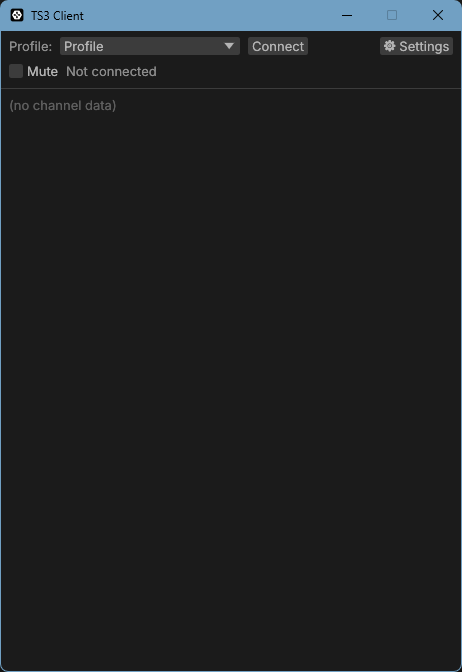

# Minimal TeamSpeak 3 Client

[English](README.md) | [日本語](README.ja.md)

A minimal TeamSpeak 3 client for Windows with a StreamDeck-friendly HTTP API, system tray integration, and auto-start. Built in Rust.

The official TeamSpeak client does more than some of us need. This client focuses on one job — being a low-latency voice client for your own TS3 server — and strips away everything else. No contacts, no chat UI, no badges. Just connect, talk, and stay out of the way in the system tray.

<p align="center"></p>

> **Note**: This is an unofficial client and is not affiliated with TeamSpeak Systems GmbH. It speaks the TeamSpeak 3 protocol via [tsclientlib](https://github.com/ReSpeak/tsclientlib).

## Features

- **Minimal UI** — a profile picker, a connect button, and a channel tree. That's it.
- **Connection profiles** — register multiple servers, each with its own display name, address, and nickname.
- **Voice** — Opus voice with selectable input/output devices and three transmission modes:
  - Continuous transmission
  - Voice activation (threshold slider with a live input level meter)
  - Push-to-talk (global hotkey — works while games have focus)
- **Per-user volume** — right-click a user in the channel tree to adjust their playback volume (0–200%). Saved per nickname across sessions.
- **StreamDeck / automation friendly** — a local HTTP API (127.0.0.1 only) for connect, disconnect, and mute, usable from any HTTP-capable StreamDeck plugin or script.
- **System tray** — closing the window hides it to the tray; a tray menu offers open/exit.
- **Auto-start** — optionally start with Windows, minimized to the tray.
- **Sound feedback** — synthesized chimes for your own connect/disconnect and when other users join or leave the server, so StreamDeck operations are audible without looking at the window.
- **Robust connection handling** — automatic reconnect after connection loss, handshake timeouts, and a diagnostic log file.
- **English / Japanese UI** — follows the OS language by default, switchable in the settings.

## Requirements

- Windows 10/11
- A TeamSpeak 3 server to connect to

## Building from source

Prerequisites:

- [Rust](https://rustup.rs/) (stable, MSVC toolchain)
- Visual Studio Build Tools with the C++ workload (for the MSVC linker)
- [CMake](https://cmake.org/) (used to build the bundled Opus codec)

```
git clone https://github.com/00b7ce/Minimal-TeamSpeak3-client.git
cd Minimal-TeamSpeak3-client
cargo build --release
```

The binary is produced at `target/release/ts3-client.exe`. It is self-contained (fonts included) — copy it wherever you like.

## Usage

1. Launch `ts3-client.exe`.
2. Open **⚙ Settings** and create a profile: profile name, server address, and nickname.
3. Click **Connect**.

Settings, including profiles, audio devices, and per-user volumes, are stored in `%APPDATA%\ts3-client\config.toml`. A diagnostic log is written to `%APPDATA%\ts3-client\ts3-client.log`.

### Command-line options

| Option | Description |
|---|---|
| `--minimized` | Start hidden in the system tray (used by auto-start) |
| `--lang ja` / `--lang en` (or `--ja` / `--en`) | Override the UI language for this session |
| `--autoconnect` | Connect to the selected profile immediately on launch |

### Transmission modes

| Mode | Behavior |
|---|---|
| Continuous | Always transmitting while connected |
| Voice activation | Transmits when the input level exceeds a threshold (with a 300 ms hangover). Use the built-in level meter to tune the threshold. |
| Push-to-talk | Transmits while a key is held. The key state is read globally, so it works while a game has focus. Selectable keys include mouse side buttons. |

## StreamDeck / HTTP API

The client listens on `http://127.0.0.1:9871/api/` (port configurable in `config.toml`, loopback only). All endpoints accept both GET and POST, so they work with simple HTTP request plugins and even a browser.

| Endpoint | Action |
|---|---|
| `/api/connect` | Connect to the currently selected profile |
| `/api/connect/{profile name}` | Connect to a specific profile by name |
| `/api/disconnect` | Disconnect |
| `/api/mute/on` `/api/mute/off` `/api/mute/toggle` | Microphone mute control |
| `/api/status` | Connection and mute state as JSON |

Example:

```
curl -X POST http://127.0.0.1:9871/api/connect
curl http://127.0.0.1:9871/api/status
{"status":"connected","server_name":"My Server","error":null,"muted":false}
```

Connect and disconnect play distinct chimes, so you get audible feedback for StreamDeck presses without looking at the window.

## Acknowledgements

- [tsclientlib](https://github.com/ReSpeak/tsclientlib) — TeamSpeak 3 protocol implementation
- [egui / eframe](https://github.com/emilk/egui) — UI framework
- [cpal](https://github.com/RustAudio/cpal) — audio I/O
- Bundled fonts: [Inter](https://rsms.me/inter/) and [Noto Sans JP](https://fonts.google.com/noto/specimen/Noto+Sans+JP), both under the SIL Open Font License (see `assets/`)

## License

Licensed under either of [Apache License, Version 2.0](LICENSE-APACHE) or [MIT license](LICENSE-MIT) at your option.
